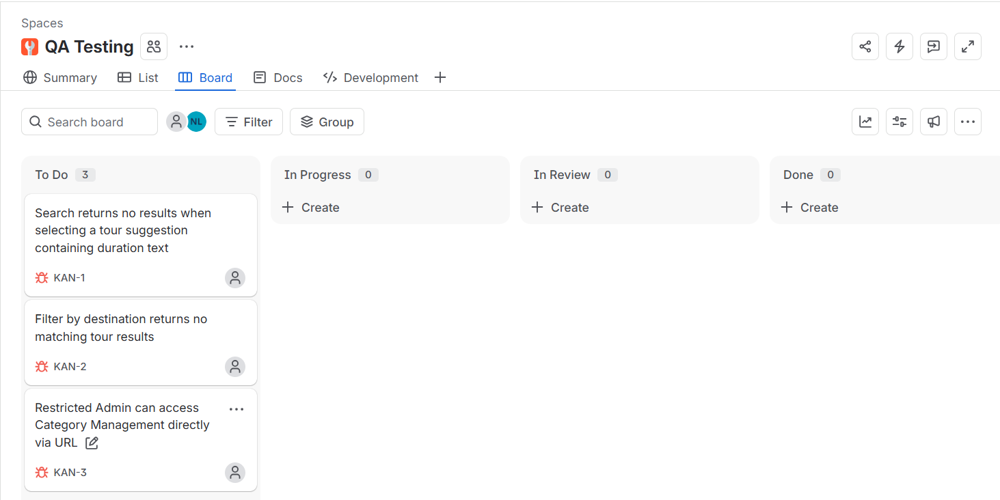
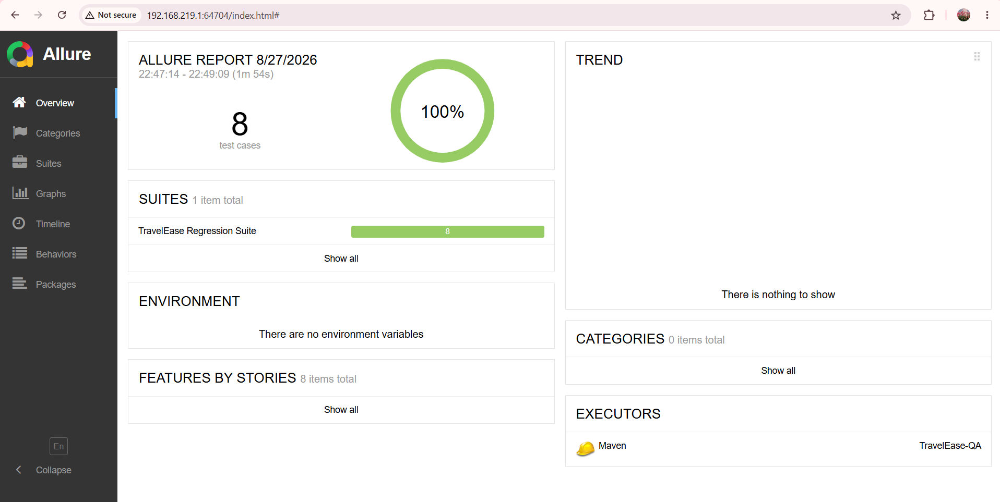
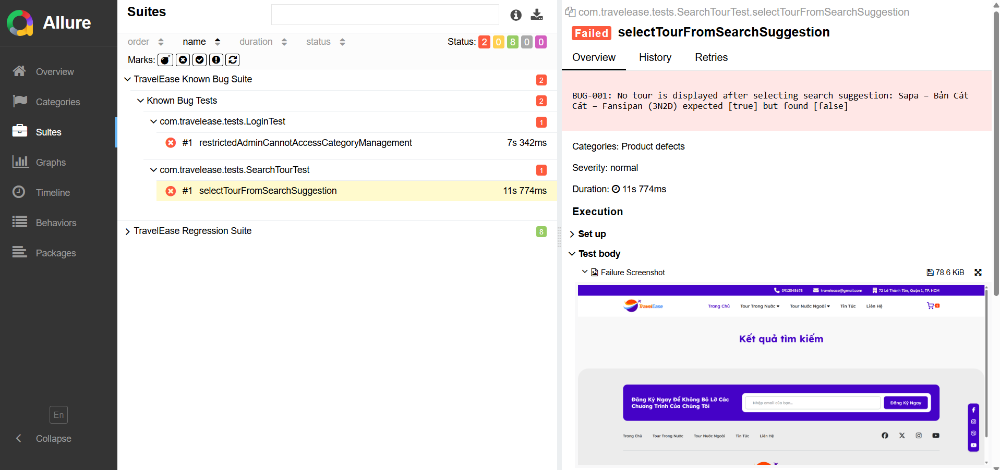
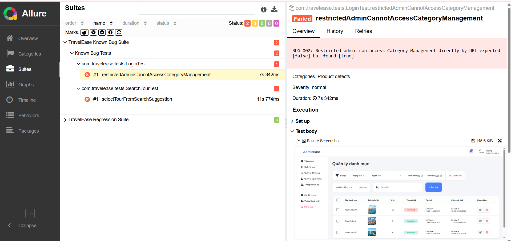

# TravelEase QA Testing Portfolio

QA testing portfolio for the **TravelEase Tour Booking Web Application**, demonstrating an end-to-end software testing workflow including **Manual Testing, API Testing, Web UI Automation, Regression Testing, Defect Reporting, and Test Reporting**.

The project combines manual and automated testing artifacts to demonstrate practical QA skills using **Java, Selenium WebDriver, TestNG, Maven, Postman, Page Object Model (POM), and Allure Report**.

The TravelEase web application and this QA repository are maintained separately so that the application source code and QA artifacts can be reviewed independently.

---

## QA Scope

Testing focuses on five main functional modules:

1. **Admin Authentication & Authorization**
2. **Tour Search & Filter**
3. **Cart & Booking**
4. **Admin Tour Management**
5. **Admin Account Management**

The testing workflow includes:

- Smoke Testing
- Test Scenario Design
- Manual Functional Testing
- Test Execution
- Bug Reporting
- API Testing with Postman
- Web UI Automation
- Regression Testing
- Role-Based Access Control (RBAC) Testing
- Known Defect Reproduction
- Test Reporting

---

## Test Results

### Overall QA Results

| Testing Type | Executed | Passed | Failed | Blocked | Pass Rate |
|---|---:|---:|---:|---:|---:|
| Manual Functional Testing | 69 | 66 | 3 | 0 | 95.7% |
| API Testing | 48 | 39 | 9 | 0 | 81.25% |
| Automation Regression | 8 | 8 | 0 | 0 | 100% |

### Smoke Testing

| Total | Passed | Failed | Blocked |
|---:|---:|---:|---:|
| 16 | 12 | 2 | 2 |

The two blocked smoke tests are related to **VNPay and ZaloPay payment integrations**, which could not be fully verified because the sandbox/integration environment was unavailable.

---

## Manual Testing

Manual testing artifacts are maintained in a dedicated Excel workbook:

**[TravelEase QA Testing Workbook](docs/qa-test-artifacts/TravelEase_QA_Testing.xlsx)**

The workbook contains:

- Smoke Test
- Test Scenarios
- Test Cases
- Test Execution
- Bug Reports
- Test Summary
- API Test Cases
- API Test Execution
- API Summary

### Functional Test Summary

| Module | Total | Passed | Failed | Pass Rate |
|---|---:|---:|---:|---:|
| Admin Authentication & Authorization | 30 | 29 | 1 | 96.7% |
| Tour Search & Filter | 11 | 9 | 2 | 81.8% |
| Cart & Booking | 10 | 10 | 0 | 100% |
| Admin Tour Management | 11 | 11 | 0 | 100% |
| Admin Account Management | 7 | 7 | 0 | 100% |
| **Total** | **69** | **66** | **3** | **95.7%** |

### Confirmed Web Defects

Three Major defects were identified during functional testing:

| Bug ID | Module | Description | Severity | Priority |
|---|---|---|---|---|
| WEB-BUG-001 | Tour Search & Filter | Search returns no results when selecting a tour suggestion containing duration text | Major | High |
| WEB-BUG-002 | Tour Search & Filter | Destination filter returns no results for a valid destination | Major | High |
| WEB-BUG-003 | Admin Authentication & Authorization | Restricted Admin can access Category Management directly via URL | Major | High |

Detailed reproduction steps, expected results, actual results, status, and evidence links are documented in the **Bug Reports** sheet of the QA workbook.

---

### Jira Defect Tracking

Confirmed web defects were also tracked using **Jira** as part of the defect management workflow.

| Jira Issue | Defect Reference | Description |
|---|---|---|
| KAN-1 | WEB-BUG-001 | Search Suggestion defect |
| KAN-2 | WEB-BUG-002 | Destination Filter defect |
| KAN-3 | WEB-BUG-003 | RBAC direct URL access defect |



---

## API Testing

API testing was performed using **Postman** across the same major TravelEase modules.

### API Test Summary

| Module | Total | Passed | Failed |
|---|---:|---:|---:|
| Search | 5 | 5 | 0 |
| Authentication | 14 | 14 | 0 |
| Cart & Booking | 10 | 5 | 5 |
| Admin Tour Management | 9 | 8 | 1 |
| Admin Account Management | 10 | 7 | 3 |
| **Total** | **48** | **39** | **9** |

**API Pass Rate: 81.25%**

The API test execution identified validation and error-handling defects involving:

- Invalid cart request data
- Missing or invalid customer information
- Orders without tour items
- Non-existing tour IDs
- Empty Admin full name
- Invalid Admin email format
- Admin password handling during account updates

Seven API defects are documented in the QA workbook as **API-BUG-004 through API-BUG-010**.

### Postman Files

The repository includes a public-safe Postman collection and environment template:

- **[TravelEase API Testing - Postman Collection](docs/postman/TravelEase_API_Testing.postman_collection.json)**
- **[TravelEase Local - Postman Environment](docs/postman/TravelEase_Local.postman_environment.json)**

Sensitive credentials are intentionally excluded from the repository.

> The documented API results represent the recorded test execution. The public-safe Postman files use environment variables so credentials can be configured locally without committing sensitive values.

---

## Automation Testing

Web UI automation is implemented using:

- **Java 21**
- **Selenium WebDriver**
- **TestNG**
- **Maven**
- **Page Object Model (POM)**
- **Allure Report**

The automation suite currently covers:

- Tour Search
- Admin Authentication
- Cart Management
- Role-Based Access Control (RBAC)

Automated scenarios include both positive and negative test cases.

---

## Automation Test Suites

### Regression Suite

The regression suite contains stable automated tests for core functionality.

Run:

```bash
mvn clean test
```

Current regression result:

```text
Tests run: 8
Failures: 0
Errors: 0
Skipped: 0

BUILD SUCCESS
```

The current regression suite contains **8 automated tests with a 100% pass rate**.

### Known Bug Suite

Confirmed application defects are separated from the stable regression suite.

Run:

```bash
mvn clean test -Dsurefire.suiteXmlFiles=testng-known-bugs.xml
```

The known-bug suite currently reproduces two confirmed defects:

- **BUG-001 - Search Suggestion:** Selecting a tour from search suggestions does not display the expected tour in the search results.
- **BUG-002 - Authorization / RBAC:** A restricted Admin can access Category Management directly through the URL despite not having the required permission.

These tests are intentionally expected to fail while the corresponding application defects remain unresolved.

### Defect Traceability

The automation defect identifiers were created before the final manual defect numbering was standardized.

| Automation Reference | Manual Defect Reference |
|---|---|
| BUG-001 - Search Suggestion | WEB-BUG-001 |
| BUG-002 - Authorization / RBAC | WEB-BUG-003 |

This mapping keeps the existing automation suite unchanged while maintaining traceability to the final manual defect reports.

---

## Automation Design

The automation framework follows the **Page Object Model (POM)** design pattern to separate page interactions from test logic.

Main components:

- **Page Objects** - Store locators and reusable page actions.
- **Test Classes** - Implement automated test scenarios and assertions.
- **BaseTest** - Handles WebDriver setup and teardown.
- **TestListener** - Captures screenshots automatically when a test fails.
- **TestNG Suites** - Separate stable regression tests from known application defects.

This structure improves test maintainability and reduces duplicated Selenium code.

---

## Failure Evidence

When an automated test fails, the framework automatically:

1. Captures a browser screenshot.
2. Saves the screenshot locally.
3. Attaches the screenshot to the Allure test result.

This provides evidence for debugging and defect investigation.

---

## Allure Report

Run the regression tests first:

```bash
mvn clean test
```

Then generate and open the Allure report:

```bash
mvn allure:serve
```

The report provides:

- Test execution status
- Test duration
- Failure details
- Stack traces
- Screenshot attachments

### Regression Evidence



---

## Known Bug Evidence

### BUG-001 - Search Suggestion

Selecting a tour from the search suggestions does not display the expected tour in the search results.

Manual defect reference: **WEB-BUG-001**



### BUG-002 - Authorization / RBAC

A restricted Admin can access Category Management directly through the URL despite not having the required permission.

Manual defect reference: **WEB-BUG-003**



---

## Test Environment

The tests currently run against the TravelEase application in a local environment:

```text
http://localhost:3000
```

The TravelEase web application must be running before executing Selenium or Postman tests.

---

## Environment Variables

Automation test credentials are managed through environment variables instead of being hard-coded in the source code.

Configure the following variables before running tests that require Admin accounts:

| Variable | Description |
|---|---|
| `TRAVELEASE_ADMIN_EMAIL` | Active Admin account email |
| `TRAVELEASE_ADMIN_PASSWORD` | Active Admin account password |
| `TRAVELEASE_INACTIVE_EMAIL` | Inactive Admin account email |
| `TRAVELEASE_INACTIVE_PASSWORD` | Inactive Admin account password |
| `TRAVELEASE_RESTRICTED_EMAIL` | Restricted-role Admin account email |
| `TRAVELEASE_RESTRICTED_PASSWORD` | Restricted-role Admin account password |

> Test credentials are intentionally excluded from the repository and should never be committed to source control.

### IntelliJ IDEA Setup

1. Open **Run -> Edit Configurations**.
2. Select the **TravelEase Regression** TestNG configuration.
3. Open **Environment variables**.
4. Add the required variables and local test-account values.
5. Run the regression suite.

---

## Project Structure

```text
TravelEase-QA/
|
|-- docs/
|   |-- allure-regression-report.png
|   |-- bug-001-search-suggestion.png
|   |-- bug-002-rbac-access.png
|   |-- jira-defect-tracking.png
|   |
|   |-- postman/
|   |   |-- TravelEase_API_Testing.postman_collection.json
|   |   `-- TravelEase_Local.postman_environment.json
|   |
|   `-- qa-test-artifacts/
|       `-- TravelEase_QA_Testing.xlsx
|
|-- src/
|   |-- main/
|   |   `-- java/
|   |       `-- com.travelease.pages/
|   |           |-- HomePage.java
|   |           |-- LoginPage.java
|   |           `-- CartPage.java
|   |
|   `-- test/
|       |-- java/
|       |   `-- com.travelease/
|       |       |-- base/
|       |       |   `-- BaseTest.java
|       |       |-- listeners/
|       |       |   `-- TestListener.java
|       |       `-- tests/
|       |
|       `-- resources/
|           `-- allure.properties
|
|-- pom.xml
|-- testng.xml
`-- testng-known-bugs.xml
```

---

## QA Workflow Demonstrated

This project demonstrates the following QA workflow:

```text
Requirement / Feature Analysis
        |
        v
Test Scenario Design
        |
        v
Smoke & Functional Testing
        |
        v
Test Execution
        |
        v
Defect Reporting
        |
        v
API Testing with Postman
        |
        v
Web UI Automation
        |
        v
Regression Testing
        |
        v
Known Defect Reproduction
        |
        v
Test Reporting & Evidence
```

---

## Project Purpose

This project was created as a practical **QA / Software Tester portfolio project** using a real web application developed as a separate project.

It demonstrates experience with:

- Designing test scenarios and test cases
- Executing manual functional tests
- Performing smoke and regression testing
- Reporting and documenting defects
- Testing APIs with Postman
- Building Selenium WebDriver automation with Java
- Applying Page Object Model
- Managing regression and known-defect test suites with TestNG
- Generating test reports with Allure
- Capturing failure evidence automatically
- Testing authentication, authorization, and RBAC behavior
- Maintaining QA artifacts and traceability

The goal is to demonstrate a complete testing process rather than only automated test execution.
